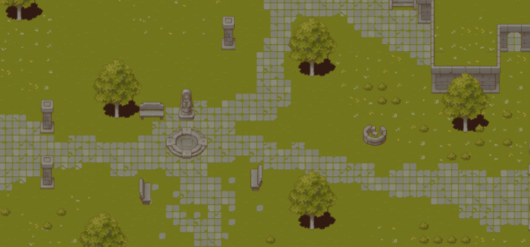
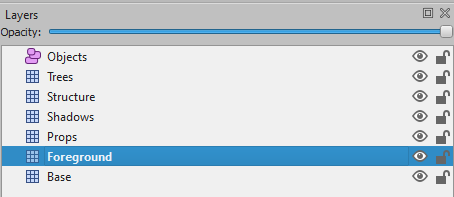

# react-pixi-tilemap

This package allows you to easily make use of levels created with [Tiled](https://www.mapeditor.org/) in your React and Pixi based games.

Supports embedded and external tilesets, collisions, child layering, and comes with a bunch of different hooks to work with tiles and objects from within your components.



## Install

```sh
$ npm install react-pixi-tilemap
# Or
$ yarn add react-pixi-tilemap
```

## Usage

Your `.tmx` files, and their associated `.tsx` and atlas files, should be in a static location, such as the `public` folder if you are using create-react-app. This makes it easy for the Tilemap component to find assets used in the map.

Using the component is dead simple. Simply load your map and pass it into the Tilemap component.

```js
import { Tilemap, useTilemapLoader } from 'react-pixi-tilemap'

const tilemap = process.env.PUBLIC_URL + '/stages/map.tmx'

const App = (props) => {
    const map = useTilemapLoader(tilemap)

    return (
        <Stage>
            <Tilemap map={map} scale={0.75} {...props}>
                <Sprite ... />
                <Sprite ... />
                <Sprite ... />
            </Tilemap>
        </Stage>
    )
}
```

The return value of `useTilemapLoader` is an Object represented by [TMX Map Format#map](https://doc.mapeditor.org/en/stable/reference/tmx-map-format/#map). Make sure to look over those docs to learn more about what properties you have access to.

Be advised that you should not use a typical `import` statement. If you `import map from './map.tmx'`, Webpack (or similar build system) will take your .tmx file away from your tilesets, which breaks the Tilemap component's discovery. As such, keeping your tilemaps and tilesets in a static location will give you the best results.

Your tilesets can either be saved as `.tsx` files, or embedded in the `.tmx` file itself. Either works with this package. Keep in mind however that you _cannot_ save your tilesets as their `.json` equivalents. This seems to be an issue with tmx-parser.

## Example

Check out the [demo project](demo) for an example of how this all comes together. Be sure to open up the [map.tmx]() file in Tiled and explore around.

To get setup, run the following commands:

```sh
$ cd demo
$ yarn install
$ yarn start
```

## Foreground Layer

Adding a `Foreground` layer to your `.tmx` file determines where children of the Tilemap component are rendered. Without this layer, children are rendered on top of the map. If you want children to appear above some layers, and behind others, then make sure to include this layer. The order of the Foreground layer in Tiled's `Layer` pane controls where the children are rendered.



## Hooks

**`useCollisions()`**

Returns a flat list of Pixi.js Rectangle instances that represent the collisions defined in the `.tmx` file. These can be configured with Tiled's [Collision Editor](https://doc.mapeditor.org/en/stable/manual/editing-tilesets/#tile-collision-editor).

```js
const collisions = useCollisions()
```

**`useInteractables()`**

Any object that has a bool `isInteractable` custom property in Tiled will be picked up by this hook. This allows you to easily define objects in the game (such as NPCs, items on the ground, etc.) as something the user can interact with, and use them in your code.

```js
const interactables = useInteractables()
```

**`useMap()`**

Returns the `map` property passed into Tilemap. This can be helpful if you need to access metadata about the map, or if you need to write a hook that is not included in this package.

See [TMX Map Format#map](https://doc.mapeditor.org/en/stable/reference/tmx-map-format/#map).

```js
const map = useMap()
```

**`useObjects()`**

Returns a flat list of every object across every layer.

See [TMX Map Format#object](https://doc.mapeditor.org/en/stable/reference/tmx-map-format/#object)

```js
const objects = useObjects()
```

**`useSpawnPoint()`**

This hook is fairly specific, but if you add an object named `Spawn`, this hook will return it for you. This makes it easy to setup a spawn location for player characters.

**`useTilemapLoader(tilemapPath)`**

This hook is what you use to load your .tmx map before passing it into the Tilemap component.

**`useTiles()`**

Returns a flat array of every tile in the map.

See [TMX Map Format#tile](https://doc.mapeditor.org/en/stable/reference/tmx-map-format/#tile).

## Credits

Thanks to Cainos' for their awesome [Pixel Art Top Down - Basic](https://cainos.itch.io/pixel-art-top-down-basic) tiles.

Also very big shoutout to the following repos that were very invaluable in figuring out how to create this package.

- [Reynau/tiled-to-pixi](https://github.com/Reynau/tiled-to-pixi)
- [knervous/tiled-pixi-react](https://github.com/knervous/tiled-pixi-react)

## Developing

Run the following commands from the root directory to install all dependencies, and get setup with a dev environment that will live-reload as you make changes to the package.

```sh
$ yarn install
$ yarn link
$ cd demo
$ yarn link react-pixi-tilemap
$ yarn install
$ cd ..
$ yarn start
```
## License

MIT
